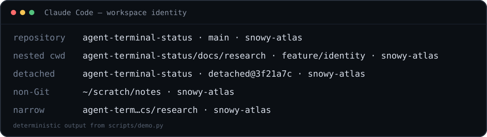

# agent-terminal-status

One quiet line that tells you where your coding agent is working.

[Website](https://agent-terminal-status.gldtestuser.chatgpt.site) ·
[How it works — English · Español · 日本語 · 繁體中文](https://agent-terminal-status.gldtestuser.chatgpt.site/docs) ·
[Quick start](#quick-start) ·
[Roadmap](ROADMAP.md)



```text
agent-terminal-status · main · snowy-atlas
```

`agent-terminal-status` is a small, dependency-light workspace identity line
for terminal coding agents. Version 0.1 targets
[Claude Code's command status line](https://code.claude.com/docs/en/statusline)
and answers the highest-value question first:

> Which directory is this agent operating in?

The repository and actual nested working directory stay visible. Git branch and
machine identity are secondary: they appear when space allows and disappear
before the path on narrow terminals.

Explore the [public project website](https://agent-terminal-status.gldtestuser.chatgpt.site);
the visual [four-language field guide](https://agent-terminal-status.gldtestuser.chatgpt.site/docs)
follows one status line from Claude payload to safe output. Their frontend-only
source lives in [`site/`](site/README.md).

## Quick start

### Windows PowerShell

From a clone or downloaded copy of this repository:

```powershell
powershell -NoProfile -ExecutionPolicy Bypass -File .\scripts\install.ps1
```

The default adapter supports Windows PowerShell 5.1 and does not require Python,
Node.js, `jq`, a Nerd Font, or a prompt framework. Git is optional.

If a status line is already configured, the installer stops without changing
settings. To deliberately replace it while preserving it for uninstall:

```powershell
powershell -NoProfile -ExecutionPolicy Bypass -File .\scripts\install.ps1 -Force
```

### macOS and Linux

Python 3.9 or newer is required:

```sh
sh scripts/install.sh
```

Both installers update user settings at `~/.claude/settings.json`. Claude Code
reloads settings automatically; interact once to refresh the line.

The project is tested with Claude Code 2.1.220. Its status-line command works
with earlier releases, while automatic terminal-width input requires Claude
Code 2.1.153 or newer; without `COLUMNS`, output uses the default 96-cell cap.

## Uninstall

The installed uninstaller restores the exact prior `statusLine` value when one
was preserved and its rollback metadata remains available. If that metadata is
missing or incomplete, uninstall warns that the prior value cannot be
reconstructed before removing the installed setting and project files.

Windows:

```powershell
powershell -NoProfile -ExecutionPolicy Bypass -File "$HOME/.claude/agent-terminal-status/uninstall.ps1"
```

macOS and Linux:

```sh
~/.claude/agent-terminal-status/uninstall.sh
```

Uninstall removes only files created by this project. If the status line was
changed after installation, that newer user setting is left untouched. Unknown
files in the install directory are also kept.

To use a non-default Claude configuration directory, pass `-ConfigDir PATH` on
Windows or `--config-dir PATH` on macOS and Linux. `CLAUDE_CONFIG_DIR` is also
respected.

## What it displays

Inside a repository:

```text
agent-terminal-status/docs/research · feature/identity · snowy-atlas
```

Outside Git:

```text
~/scratch/notes · snowy-atlas
```

Detached HEAD:

```text
agent-terminal-status · detached@3f21a7c · snowy-atlas
```

The renderer:

1. reads `workspace.current_dir` from Claude Code, with safe fallbacks;
2. asks Git about that exact directory using `git -C`;
3. shows `repo-name/relative/current/dir`;
4. falls back to a home-relative or absolute path outside Git;
5. appends branch and hostname while space permits.

Git worktrees naturally identify themselves by their worktree root and branch.
SSH, WSL, and container sessions report the hostname visible inside that
environment; use a friendly machine alias when the generated name is opaque.

Output is monochrome, icon-free, and one line by default. Width calculations
account for wide CJK characters. At narrow widths the path is shortened in the
middle, then the branch and host are progressively removed. Before rendering,
both adapters replace Unicode control, format, surrogate, and line-separator
characters with spaces so invisible direction overrides cannot falsify the
displayed identity or create a second line. This deliberately includes format
characters such as ZWJ and ZWNJ: a complex emoji or connected script may lose
its preferred shaping, but the identity row remains visible, directional, and
measurable.

## Configuration

Set environment values before starting Claude Code, or add them to the existing
`env` object in `~/.claude/settings.json`:

```json
{
  "env": {
    "ATS_MACHINE": "snowy-atlas",
    "ATS_PATH_STYLE": "context",
    "ATS_SHOW_BRANCH": "auto",
    "ATS_SHOW_HOST": "auto",
    "ATS_MAX_WIDTH": "72"
  }
}
```

| Variable | Default | Values and behavior |
| --- | --- | --- |
| `ATS_MACHINE` | system hostname | Friendly local, SSH, WSL, or container name |
| `ATS_PATH_STYLE` | `context` | `context`, `full`, or `name` |
| `ATS_SHOW_BRANCH` | `auto` | `auto`, `always`, or `never` |
| `ATS_SHOW_HOST` | `auto` | `auto`, `always`, or `never` |
| `ATS_MAX_WIDTH` | `96` | Output cap from 12 to 512 terminal cells |
| `ATS_ASCII` | unset | `1` uses ` | ` and `...` instead of Unicode separators |
| `ATS_GIT_TIMEOUT_MS` | `150` | Git deadline, clamped from 25 to 2000 ms |

`context` is the recommended path style. It keeps both repository identity and
the actual nested directory. `full` uses a home-relative path when possible;
`name` displays only the current directory leaf.

Hostnames can expose machine naming conventions in screenshots or screen
shares. Set `ATS_MACHINE` to a public alias or `ATS_SHOW_HOST=never` when that
matters.

## Install behavior

Installation is intentionally reversible:

- files are copied to `~/.claude/agent-terminal-status/`;
- `settings.json` is parsed before any change and written atomically;
- invalid JSON is refused without modification;
- replacing an existing status line requires explicit force;
- reinstall is idempotent and retains the original rollback value while its
  metadata remains valid;
- if rollback metadata is missing or incomplete, reinstall repairs the adapter
  but marks rollback as unknown instead of treating its own command as prior
  user configuration;
- uninstall restores settings only while the active command is still ours.

Both installers preserve settings semantics but may normalize indentation,
escaping, and line endings when writing `settings.json`; uninstall does not
promise byte-identical formatting. UTF-8 files with or without a BOM are
accepted. If settings become unreadable after installation, uninstall leaves
them untouched, warns with a repair path, and still removes only this project's
known files.

On Windows, the configured command uses quoted forward-slash paths because
Claude Code may route commands through Git Bash, which otherwise consumes
backslashes. It also uses process-scoped `-ExecutionPolicy Bypass` so the copied
adapter runs under the common default Windows PowerShell policy without
changing machine or user policy.

## Test and inspect

No package installation is needed.

```powershell
python -m unittest discover -s tests -p "test_*.py" -v
powershell -NoProfile -ExecutionPolicy Bypass -File .\tests\run.ps1
pwsh -NoProfile -File .\tests\run.ps1
python .\scripts\demo.py
python .\scripts\benchmark.py
```

Tests cover Git and non-Git directories, spaces and non-ASCII paths, detached
HEAD, linked worktrees, missing Git, malformed input, reversible installer
behavior, and a table-driven width invariant across every branch/host mode. CI
runs Python on Windows, macOS, and Linux, plus Windows PowerShell 5.1 and
PowerShell 7.

Measured latency and methodology are in
[docs/performance.md](docs/performance.md).

## Design and project direction

Version 0.1 deliberately uses two small command adapters instead of a framework:

```text
Claude status JSON
        |
        v
PowerShell or Python adapter
        |
        v
cwd + bounded Git collector + machine
        |
        v
one compact identity line
```

The normalized identity is already separate from rendering, but package-level
abstractions wait until a second agent integration proves what should be shared.
See:

- [VISION.md](VISION.md) for the workspace identity thesis;
- [ROADMAP.md](ROADMAP.md) for validated and exploratory work;
- [the public release evidence gate](docs/release-evidence.md) for the
  observation protocol and privacy boundary;
- [the architecture decision](docs/decisions/0001-identity-first-command-adapters.md);
- [research findings](docs/research.md);
- [the upstream Claude Code evidence packet](docs/upstream.md).

The project is not trying to out-theme mature status-line tools. Its initial
job is reliable orientation, safe installation, and evidence for a quiet native
workspace identity in coding-agent terminals.

## Current limitations

- Claude Code controls when the command reruns and temporarily hides its custom
  status line during some UI interactions.
- Terminal resize is not currently an update trigger. Width refreshes on the
  next Claude event; `refreshInterval` is available but deliberately not enabled
  by default because it continuously starts a process in every session.
- A 150 ms Git timeout favors a present path over a delayed branch on slow
  network filesystems.
- Windows PowerShell avoids an extra runtime but has higher process startup cost
  than Python.
- Claude Code compatibility bugs can prevent an otherwise valid custom status
  line from appearing: [#79433](https://github.com/anthropics/claude-code/issues/79433)
  tracks silent fallback to the default on some versions, and
  [#76411](https://github.com/anthropics/claude-code/issues/76411) tracks missing
  custom output in macOS fullscreen TUI mode.
- The main Claude Code status line cannot currently be distributed as a plugin
  default, so version 0.1 uses a settings installer.
- Agent/model/context, dirty state, and coordination signals are intentionally
  outside the default 0.1 line.

## Contributing

Read [CONTRIBUTING.md](CONTRIBUTING.md). Small evidence-backed improvements are
preferred over speculative modules.

MIT licensed.
